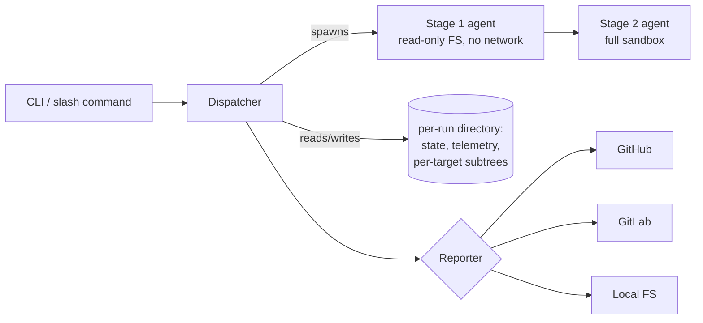

# LLM-based Vulnerability Detector — Architecture

This document captures architectural and technical decisions for LLM-based Vulnerability Detector. It is the *how* — the companion to `requirements.md` (the *what*). Concrete implementation details (file paths, function signatures, exact algorithms, library choices) live in `plans/implementation.md`, not here.

---

## 1. Architectural overview

### 1.1 System topology

LLM-based Vulnerability Detector is a single-process **dispatcher** that fans out work to per-target **agent subprocesses** in two sequential stages, persists state to a per-run directory on disk, and emits artifacts through a pluggable **reporter** boundary.

The dispatcher is the single writer to shared run state. Agent subprocesses write only inside their own per-target subtree. This separation is the foundation of resumability and crash isolation.

### 1.2 Component responsibilities

- **Dispatcher** — discovers targets, enforces the concurrency cap, transitions per-target state, drives the reporter, owns the manifest. One process per run.
- **Stage-1 agent** — produces a structured finding (or a "no finding" record) for one file. Read-only filesystem; no network.
- **Stage-2 agent** — given a finding, attempts an exploit, then a unit test, then declares the finding theoretical. Full sandbox: network, package install, shell.
- **Reporter** — adapter to the outbound destination (GitHub / GitLab / local disk). The only component that pushes branches or creates issues.
- **Substrate** — the host the engine runs on (web-sandbox or DIY-cloud VM). The engine is substrate-agnostic; only the bootstrap and a preflight gate are substrate-aware.

### 1.3 Architectural principles

The following invariants shape the codebase. They are listed here so coding agents working in any module know which guarantees the code is structured to enforce.

**1.3.1 Stage isolation is a security boundary.** Stage 1 reads code; stage 2 runs code. They are different OS processes with different capability sets — stage 1 has no network and read-only filesystem access; stage 2 has full sandbox. Any change that lets stage 1 call out, or lets stage 2 write to the source tree, is an architectural regression.

**1.3.2 Filesystem is the source of truth for run state.** There is no in-memory authoritative state — the dispatcher's state machine is recoverable from disk alone. State writes are atomic; telemetry files truncate on startup; no two processes write the same file. Resumability falls out of this discipline rather than being bolted on.

**1.3.3 The reporter is the only outbound boundary.** All HTTP to forges, branch pushes, and issue creates live behind one interface. Local mode is the same interface writing to disk. Code outside the reporter never imports a forge SDK or constructs a forge-bound HTTP request — this is what makes `output.mode: local` a one-line switch and adding a new forge orthogonal to other work.

**1.3.4 Outcome tier is the routing key.** `(tier, severity_self_rated) → (branch?, priority, bump_reason)` is one function in one place. The reporter, the manifest renderer, and the issue-body builder consume its output; none of them recompute the rule. The bump rule is upward-only and tier-gated.

**1.3.5 Fingerprint is the identity for findings.** Every finding carries a content-derived fingerprint; the issue body embeds it as a hidden marker; the reporter exposes a "find by identity" lookup against that marker. The fingerprint is computed once at stage 1 and never recomputed downstream — that invariant is what makes resume reconciliation and dedup tractable.

**1.3.6 Single dispatcher, many agents, bounded blast radius.** The dispatcher is one process; agents are subprocesses with per-target working directories. An agent crash releases its slot and surfaces in the manifest; sibling agents and the run as a whole are unaffected. Shared mutable state across agents, or cross-agent file writes, are regressions.

**1.3.7 Substrate-agnostic engine, substrate-specific bootstrap.** The engine binary is identical on web-sandbox and DIY-cloud. Substrate awareness is confined to the slash-command bootstrap and a preflight gate that refuses oversized runs in the web sandbox.

## 2. Stack & language

**Node.js (LTS) + TypeScript, run directly via `tsx`.** No compile step. The CLI runs as `tsx ./src/cli.ts ...`; the slash-command bootstrap is `npx -y tsx ./src/cli.ts ...` from a checked-out repo. Two constraints anchor the choice: the Claude Agent SDK is first-class in TypeScript, and the no-publish bootstrap path needs a runtime that `npx` can fetch and execute against an unbuilt source tree.

**Strict TypeScript.** `strict: true`. Loosening strict-mode flags for convenience is a regression — they catch the kind of "is this field possibly undefined" bug that the resumability logic depends on.

**Agent execution: Claude Agent SDK, one child process per agent.** Each stage-1 and stage-2 invocation runs in a subprocess spawned by the dispatcher. The subprocess boundary is what enforces principles 1.3.1 (stage isolation as a security boundary) and 1.3.6 (bounded blast radius per agent). In-process invocation is not an acceptable alternative — it would collapse both invariants.

The dispatcher reaches the agent through a **runner** interface — "given a target and a capability set, write the expected artifact files into the per-target subtree, then exit." The default runner spawns the Claude Agent SDK; a peer **fixture runner** reads canned outputs from a test fixture and writes them under the same names. The runner is the swap point that lets workflow tests cover the full pipeline without invoking an LLM. Both runners are subprocesses — the seam does not weaken stage isolation.

**No external services at runtime.** No database, no queue, no message broker, no cache server. Run state is the filesystem (principle 1.3.2); configuration is YAML; state and manifest files are JSON; outbound network is exclusively the reporter (forge HTTPS) and the stage-2 sandbox (open egress).

**Libraries.** Specific package selection defers to the implementation plan. The required concerns are: YAML config parsing, gitignore-style pattern matching, child-process orchestration, JSON-schema validation for state and manifest files, and HTTPS clients for GitHub and GitLab. One library per concern; no monorepo or workspace tooling.

## 3. Process & concurrency model

### 3.1 The concurrency unit is the pipeline, not the agent

The cap of N applies to *pipelines*, where one pipeline = one stage-1 invocation followed (when applicable) by one stage-2 invocation for the same target file. A slot is held from the moment stage 1 spawns until the pipeline reaches a terminal state (`done`, `failed`, `no_finding`, or `skipped_dup`). Two slots are never consumed by the same target.

Counting agents instead of pipelines would let stage-2 work starve stage-1 work (or vice versa) without a corresponding gain — agents are short-lived subprocesses and the per-target find→exploit sequence is the natural unit of work.

### 3.2 Stage-1 → stage-2 sequencing within a pipeline

Stage 2 only runs when stage 1 terminates with a finding. A "no finding" outcome or a stage-1 failure short-circuits the pipeline to its terminal state without invoking stage 2. Stage 1 and stage 2 do not communicate directly; the dispatcher reads stage 1's output from disk, decides whether to spawn stage 2, and passes the finding to it.

### 3.3 Failure isolation per pipeline

Every pipeline has its own exception boundary in the dispatcher. A stage-1 or stage-2 crash, hang, or wall-clock timeout:

- frees the pipeline's slot,
- records the failure in the per-target outcome and the manifest,
- never corrupts shared state or sibling pipelines.

Sibling pipelines do not observe each other. Cross-pipeline file writes or any form of shared mutable state are regressions.

### 3.4 No automatic retry

A failed pipeline is terminal within a run. Re-running failed targets is the job of `resume` (FR-12), not the dispatcher's main loop. This keeps the per-run state machine deterministic and prevents retry storms on transient agent failures.

### 3.5 Wall-clock enforcement

Two budgets exist, both owned by the dispatcher:

- **Per-finding stage-2 cap** (default 10 min, configurable). Exceeding the cap is treated as a stage-2 outcome, not a crash: the pipeline downgrades to tier 3 and proceeds to reporting (per FR-5).
- **Run-level budget.** Hitting the run cap is a graceful termination: in-flight agents are signaled to terminate, the dispatcher flushes partial state to disk, the manifest records the budget kill, and pipelines that had not yet started are not started.

Agents do not self-enforce wall-clock caps. Timer ownership is the dispatcher's.

All wall-clock and monotonic-clock reads in the engine — budget enforcement, run-id generation (§4.5), `started_at` stamps in the live-agents file (§6) — go through one **clock** module. Production wires the system clock; tests substitute a deterministic clock. Code that reads time directly from the runtime is a regression.

### 3.6 Dispatcher-as-sole-writer of shared state; agents communicate by file + exit

Agents write only inside their own per-target subtree (the per-target finding and outcome files). The dispatcher is the only writer to any file shared across pipelines (`state.json`, `active.json`, the manifest). State transitions happen on the dispatcher's main loop after it observes an agent's terminal exit and reads the files the agent wrote.

There is no in-process channel and no RPC from agents to the dispatcher. Agents communicate upstream by writing files and exiting; the dispatcher communicates downstream by spawning agents with arguments and (for termination) by signaling them. This file+exit contract holds regardless of which runner (§2) is bound — the default and the fixture runner are interchangeable from the dispatcher's perspective. Adding a side channel would re-introduce the cross-pipeline coupling that 1.3.6 forbids.

## 4. Filesystem layout

### 4.1 The run directory is the container for everything a run produces

A run writes into a single directory tree rooted at `<repo>/.lbvd/<run-id>/`. Outside that tree, the run mutates only the configured outbound destination (forge or local-mode report dir) and standard log streams. `.lbvd/` is in the project's `.gitignore` (requirements §11).

### 4.2 Two write zones inside the run tree

The run tree has exactly two kinds of writers:

- **Dispatcher zone** — top-level files of the run directory: the run state, the live-agents telemetry file, the manifest (JSON + markdown), the run config snapshot, and run-level logs. Single-writer rule applies (principle 1.3.2; §3.6).
- **Per-target subtrees** — one directory per target file, owned exclusively by that target's pipeline. Stage 1 and stage 2 for that target write only here. The dispatcher reads from these subtrees but never writes into them after the pipeline starts.

No other actor touches the run tree. The two-zone partition is what makes the single-writer discipline tractable: every shared file has exactly one writer, and per-target files are scoped to one writer by construction.

### 4.3 Per-target subtree contents

Each per-target subtree holds the artifacts that pipeline produced — the stage-1 finding record, the stage-2 outcome record, the runnable artifact (exploit script or unit test) when applicable, the agent's redacted transcript, and per-stage logs. Exact filenames and schemas are specified in §7 (stage-1 contract), §8 (stage-2 contract), and §15 (logging & transcripts).

### 4.4 Local-mode reporter output

When `output.mode: local`, the reporter writes branch artifacts and issue bodies as files into a dedicated subtree inside the run directory — distinct from both the dispatcher zone and the per-target subtrees. The local-mode subtree mirrors the artifact set the forge reporters would produce, so a reviewer can inspect the same content as files. Detailed layout is in §10 (Reporter abstraction).

### 4.5 Run identifier

The run identifier is generated once at run start and is the only piece of run-level state the rest of the system depends on for path resolution. The architectural requirements on its format:

- **Unique** across runs on the same host (collisions silently break resumability).
- **Path-safe** as a directory name on macOS, Linux, and within the web sandbox.
- **Sortable by creation time** so a chronological listing of `.lbvd/` is the natural triage order.
- **Caller-injectable** — the run-id may be supplied externally (CLI flag, env, test harness). Generation is the default path, not the only path. This is what lets workflow tests assert against a stable on-disk shape.

The exact encoding (timestamp + suffix, ULID, etc.) is an implementation choice subject to the four constraints above.

### 4.6 Per-finding identifier

Every finding carries an identifier — the fingerprint (§11) — used to name its per-target subtree and (for tier 1 / tier 2) its branch and artifact paths. The identifier satisfies three constraints:

- **Stable** — deterministic given the same input.
- **Path-safe** — usable as a directory and branch component.
- **Namespace-separable** — finding identifiers and infra-tracking identifiers never collide (§11.3).

## 5. Run state & resumability

### 5.1 State as the dispatcher's authoritative ledger

The dispatcher maintains one run-state file in the dispatcher zone (§4.2) recording each target's current state. It is the authoritative source for every cross-target decision the dispatcher makes — slot accounting, resume planning, terminal counts for the manifest. There is no in-memory truth; all cross-pipeline reads and writes go through this file.

Writes are atomic (write-temp-then-rename). A crash mid-write is impossible to observe: either the new state is fully present, or the previous state is. This is what lets resume trust whatever it reads.

### 5.2 Per-target state machine: forward-only, named terminals

Each target progresses through a fixed state machine from `queued` to one of four terminal states: `done`, `failed`, `no_finding`, `skipped_dup`. Intermediate states track the active stage and the active reporter step (one per outbound side-effect that must be resumable independently). The closed enumeration is the contract; new states are added only by an explicit decision-log entry.

Two invariants:

- **Forward-only.** A target never moves backward in the machine. Resume's job is to drive non-terminal targets toward a terminal state; it never demotes a state.
- **Terminal is sticky.** Once a target is terminal, no future resume re-runs it. This is what lets a single uninterrupted run and a crash-and-resume run produce the same manifest.

### 5.3 Resume granularity is the stage, not the agent

Agents are not internally resumable. If stage 1 crashes mid-execution, resume restarts stage 1 from scratch for that target — there is no within-agent checkpoint, and the same applies to stage 2. This is a deliberate simplification: agents stay stateless, and the dispatcher only needs to track *which stage* a target was in, not how far the agent got inside it.

### 5.4 Reconciliation against the forge for reporter sub-states

The reporter's actions (branch push, issue creation) are not atomic with state writes — there is always a window where the side effect has landed on the forge but the state file has not yet recorded it. Resume handles this by querying the forge before re-attempting:

- Before pushing a branch, check whether the deterministic branch name already exists on the forge and skip if so.
- Before opening an issue, check whether an open issue carrying this finding's identity marker already exists and skip (or comment, per the FR-7 / FR-8 routing rules) if so.

This makes the resume step idempotent against the forge: exactly one branch and exactly one issue per finding, regardless of how many times resume runs. In local mode the same idempotency check is a filesystem check against the local-report subtree.

### 5.5 No event log, no WAL

The state file is the truth, not a sequence of events to replay. The dispatcher does not maintain a separate journal of state transitions. This keeps the on-disk story to one state file plus the per-target subtrees, and avoids the "replay vs. checkpoint divergence" failure mode that journaling architectures introduce.

## 6. Concurrency telemetry

### 6.1 Purpose: observability, not authority

The live-agents file (in the dispatcher zone, §4.2) lists the agents currently running. It is the runtime evidence that the concurrency cap is honored (FR-3 acceptance), consumed by the verification harness and external observers; nothing in the engine treats it as authoritative.

Slot accounting lives in the dispatcher's process; cross-target ground truth lives in the run state file (§5). The live-agents file is a snapshot of the dispatcher's current spawn set, written for observation only.

### 6.2 Lifecycle

- **Truncate at startup.** Every run (initial or `resume`) opens with a fresh, empty file. Old run telemetry never bleeds into a new run.
- **Append on spawn.** When the dispatcher spawns an agent, an entry is added with the agent's identity, target, stage, and start time.
- **Remove on exit.** When the agent exits (success, failure, or signaled termination), the entry is removed.

The end-of-run state of the file is the empty list, regardless of what happened during the run.

### 6.3 Single-writer rule

Only the dispatcher writes the live-agents file. Agents do not announce themselves; they are recorded by their parent on spawn and reaped by their parent on exit. This keeps the file consistent with the dispatcher's spawn set and avoids the lost-update class of bug any agent-writer scheme would invite. Writes are atomic (write-temp-then-rename), same discipline as the run state file.

### 6.4 Crash recovery: rebuild, not adopt

If the dispatcher crashes, the live-agents file is stale by definition (the listed agents may no longer exist). On `resume`, the dispatcher truncates the file before doing anything else; the previously listed PIDs are *not* used for adoption. Resume always starts fresh agents based on the run state file (§5).

A stale live-agents file with a dead dispatcher is therefore not a runtime fact about the system — observers should treat the file as meaningful only while the dispatcher process is alive.

## 7. Stage-1 contract

### 7.1 Output is a structured artifact, not a stream

Stage 1 produces exactly one artifact per target — a structured finding record written to the per-target subtree (§4.3). The dispatcher consumes this artifact; nothing else stage 1 emits is consulted for routing decisions.

### 7.2 "No finding" is a first-class outcome, distinct from failure

The finding record explicitly distinguishes:

- **Vulnerability found** — narrative, location, agent self-rated severity.
- **No vulnerability found** — a short reason.

A pipeline outcome of `failed` (FR-4 acceptance) is the absence of either: no record at the expected path, a malformed record, or one that fails schema validation. `failed` is not a value the agent writes — it is what the dispatcher records when it cannot read a valid artifact.

This split is what lets the manifest separate honest "no finding" from agent failure. A coding agent should never collapse "no finding" into "no output" or vice versa.

### 7.3 Scan scope and network restriction are capability-layer, not prompt-layer

Scan scope (FR-4: `hint_only`, `hint+verify`, `repo_wide`) and the no-network rule are enforced by the agent's capability set, not by instructions inside the prompt. If scope is `hint_only`, the agent literally cannot read files other than the target. If network is denied, the agent has no network-capable tool.

This is the same family of boundary as principle 1.3.1: prompt-level rules are advisory; capability-level rules are load-bearing. A change that relaxes one of these via prompt instruction rather than capability change is a regression.

### 7.4 Severity is the agent's self-assessment of impact

The finding record carries a `severity_self_rated` field (low / medium / high) — the agent's read of *impact if the finding is real*. This is distinct from stage 2's confidence, which measures *likelihood the finding is real*. The two are consumed together by §9 (outcome routing) and by the manifest (FR-13).

The engine does not re-rate severity. It records it for the bump rule's audit trail in the issue body.

### 7.5 Identity stamp is computed at stage 1 and never recomputed downstream

Every finding record carries an identity field — the fingerprint (§11) — used by the per-target subtree path (§4.6) and by the reporter for branch and artifact paths (§10). The identity is sealed in stage 1's terminal output and never recomputed; stage 2's outcome and the reporter's actions all reference it by that fixed value. Recomputing identity downstream would break dedup and resume reconciliation.

## 8. Stage-2 contract

### 8.1 Strict tier order, not best-of-three

Stage 2 attempts evidence in a fixed order:

1. A runnable exploit script that demonstrates the vulnerability when executed → **tier 1**.
2. Only if (1) fails within the attempt budget: a unit test in the project's framework asserting on the unwanted behavior → **tier 2**.
3. Only if (2) also fails: declare the finding theoretical → **tier 3**.

Stage 2 does not try all three and pick the best result. The first form of evidence it can produce is the outcome. This is what makes the tier value load-bearing for routing (§9).

### 8.2 Tier is a claim that the dispatcher validates against artifacts on disk

The agent writes a tier in its outcome record, but the dispatcher validates the claim against the per-target subtree:

- A **tier-1** claim requires an exploit artifact, a successful execution record, and `exploit_targets_application: true` (the agent confirms the exploit interacted with the live running application, not just a self-contained PoC). Without all three, the dispatcher downgrades to tier 2.
- A **tier-2** claim requires either (a) a unit-test artifact with a recorded non-zero exit code (proves the test actually catches the bug) or (b) an exploit artifact with any execution record (for PoC exploits downgraded from tier 1). Without the required evidence, the dispatcher downgrades to tier 3.
- **Tier 3** is always accepted.

This keeps the tier value falsifiable and prevents the agent from over-claiming.

**Advisory limitation.** `exploit_targets_application` is self-reported by the agent and cannot be independently verified by the engine. The check is safe-direction by default: `null`, `false`, or absent all trigger a downgrade. A deliberately deceptive agent could still write `true` to maintain Tier 1 status — this is the same outcome as the pre-check behavior where all cleanly-running exploits were Tier 1. The gate improves classification for honest agents and is documented here rather than treated as a falsifiable invariant (decision 25).

### 8.3 Tier-bound confidence semantics

The outcome record carries a confidence integer 0–100. Confidence is *not* free-form — it is bounded by tier:

- **Tier 1** → confidence = 100, engine-fixed.
- **Tier 2** → confidence is the agent's assessment, clamped to `[0, 100]`.
- **Tier 3** → confidence = 0, engine-fixed.

Confidence measures *likelihood the finding is real*; it is distinct from severity (impact, §7.4). Both feed routing (§9) and the manifest (FR-13).

### 8.4 Sandbox capabilities and the outbound-write prohibition

Stage 2 has full sandbox: network egress, package installation, shell, the ability to spin up local services. It does *not* have outbound write capability — branch pushes and issue creation are owned by the reporter (FR-7). Stage 2 writes only to its per-target subtree (§4.3); the reporter reads from there.

This split is what makes the reporter's idempotency story (§5.4) tractable: outbound side effects are gated and named centrally, and a stage-2 retry on resume cannot accidentally double-publish.

### 8.5 Infra setup attempt and `infra_requirements`

When exploitation requires a running service the project does not ship a way to start (database, broker, queue, etc.), stage 2 attempts setup within its wall-clock budget. If setup fails:

- Stage 2 records `infra_requirements` in the outcome — what was needed and what was tried.
- The outcome downgrades (typically to tier 3, per FR-5).
- The reporter files a *separate* infra-tracking issue (§10) so the operator can pre-stage the dependency for a future run.

The infra-tracking issue is the third class of issue alongside finding issues and link-only tracking issues. Its identity lives in a different namespace from finding identities (§4.6, §11).

### 8.6 Wall-clock cap is a deterministic downgrade, not a crash

The per-finding stage-2 cap (default 10 min) is enforced by the dispatcher (§3.5). Exceeding it is treated as a stage-2 outcome:

- The outcome is recorded as tier 3 with confidence 0.
- The pipeline proceeds to reporting normally.
- The manifest records a budget-kill on the target, not a crash.

This keeps a runaway exploit attempt from poisoning the rest of the run, and lets the manifest distinguish "tier 3 because we ran out of time" from "tier 3 because the agent gave up."

## 9. Outcome routing & severity bump

### 9.1 Routing is one pure function in one place

The mapping `(tier, severity_self_rated) → (branch?, priority, bump_reason)` is a single pure function. The reporter, the manifest renderer, and the issue-body builder all call it; none of them recompute the rule. A new consumer of routing means calling the function, not re-deriving the table.

This is what keeps the routing rule auditable: the function is the canonical place to read what LLM-based Vulnerability Detector does, the place to change behavior, and the place tests assert against.

### 9.2 Branch decision is tier-only; severity never produces a branch

Whether to push a branch is determined exclusively by tier: tier 1 and tier 2 → branch; tier 3 → no branch. The severity bump rule (§9.3) can change priority labels but never changes the branch decision. A tier-3 finding with self-rated `high` still gets no branch — there is no executable evidence to commit. "Branch-or-not" is gated by *evidence*, not by *impact*.

### 9.3 Severity bump: upward-only, tier-gated

The base priority mapping (FR-6):

- Tier 1 → `high` (severity rating ignored — a working exploit is always high).
- Tier 2 → `medium`, may bump to `high` if `severity_self_rated = high`.
- Tier 3 → `low`, may bump to `medium` if `severity_self_rated ∈ {medium, high}`.

Three architectural constraints on the rule:

- **Upward-only.** Bumps never lower a priority. A tier-2 self-rated `low` stays `medium`.
- **Tier-gated.** Tier 1 ignores the bump rule entirely; its priority is engine-fixed.
- **Priority label only.** The rule never changes the tier, the confidence value, or the branch decision.

The full bumped/unbumped table is in FR-6.

### 9.4 Bump reasoning is recorded in the issue body

When the rule changes the priority, the issue body records the base, the bump, and the reason — e.g., "base medium → high because severity_self_rated=high". The audit trail lives in the artifact (the issue) rather than in a side log, so a reviewer can verify the routing decision without consulting the manifest. When no bump applies, the body records the priority bump as `none`.

## 10. Reporter abstraction

### 10.1 Reporter is the engine's only outbound boundary

All forge interaction lives behind one interface (principle 1.3.3). The engine speaks to the reporter; the reporter speaks to GitHub / GitLab / disk. No code outside the reporter imports a forge SDK or constructs a forge HTTPS request. This is what makes `output.mode: local` a one-line switch and adding a new forge orthogonal to other work.

### 10.2 Three implementations, one interface

- **GitHub reporter** — pushes branches via HTTPS with a token from env; opens issues via the REST API.
- **GitLab reporter** — same shape, GitLab equivalents. *Post-MVP*: the
  current `selectReporter()` rejects `vcs.provider=gitlab`. The interface
  reserves the seat.
- **Local reporter** — implements the same interface against the local-mode subtree (§4.4); produces the same artifact set as files on disk. No network calls.

The interface is the same for all three; the engine never branches on which implementation is loaded. The Local reporter is a peer implementation, not a special case inside GitHub or GitLab.

### 10.3 Three classes of issue, routed by the reporter

The reporter (not the engine) decides which class(es) of issue an outcome maps to:

- **Finding issue** — the canonical issue produced for a stage-1+stage-2 outcome. Carries narrative, priority, bump trail, reproduction instructions, identity marker.
- **Link-only tracking issue** — opened in the source repo *only* when `vcs.exploit_target_repo` is configured. Contains a link to the finding issue in the target repo and nothing else.
- **Infra-tracking issue** — opened when stage 2 records `infra_requirements` (§8.5). Lives in a separate identity namespace from finding issues so the two never cross-match.

The engine asks the reporter to "report this outcome"; the reporter handles class routing based on configuration and outcome shape.

### 10.4 Source-vs-target repo split

When `vcs.exploit_target_repo` is configured, branches and finding issues are written to the *target* repo and a link-only tracking issue is written to the *source* repo. A separate token may be configured for the target repo via `vcs.exploit_target_token_env`. Engine verifies write access to both repos at startup; if either check fails, the run aborts before any agent is spawned.

When the target repo is not configured, everything is written to the source repo and no link-only tracking issue is produced. The dedup query target follows the same routing — the reporter queries whichever repo holds finding issues.

The split is opaque to the engine: it asks the reporter to publish, and the reporter handles which repo gets what.

### 10.5 Determinism is the contract for resume

For resume to be idempotent (§5.4), the reporter's outputs must be deterministically named:

- **Branch names** are derived from the per-finding identity (§4.6) by a fixed scheme.
- **Issue identity markers** are a hidden HTML comment in the issue body, queryable by exact-string match (§11.2).

A non-deterministic naming choice — random suffixes, timestamps in branch names, formatting drift in the marker — would break "exactly one branch and exactly one issue per finding" on resume. This is the load-bearing reason the reporter interface exposes a "find by identity" lookup at all.

### 10.6 Forge reporters are tested against recorded HTTP, not live forges

The Local reporter is exercised in every workflow test (it writes synchronously, no network). The GitHub and GitLab reporters are exercised against **recorded HTTP transcripts** committed alongside the test repo; CI replays the recordings. A separate, manually invoked suite re-records the transcripts against a designated test repo when the reporter changes which API surface it touches.

Live-forge calls are not part of the regular test suite. The same posture as principle 1.3.3 — outbound calls are concentrated in one place — applied to test infrastructure.

## 11. Fingerprinting & deduplication

### 11.1 Fingerprint = the stable identity of a finding across runs

A fingerprint is a deterministic, content-derived identifier for a finding. Two runs producing the "same" finding must produce the same fingerprint; two distinct findings must (with overwhelming probability) produce different fingerprints. The chosen algorithm is a SHA over `(category + normalized snippet)` truncated to 12 hex characters (decision 9). What matters at the architectural level is the contract: stable, content-derived, opaque to the rest of the system.

The fingerprint is computed once at stage 1 (§7.5) and never recomputed downstream.

### 11.2 Hidden identity marker in the issue body

Every finding-class issue carries a hidden marker — an HTML comment in the issue body — encoding the fingerprint. The marker is the primary lookup key for the reporter's "find issue by identity" call (§10.5).

The marker matching contract:

- **Exact string.** The lookup is a literal exact-string match including the comment delimiters. No substring search, no regex, no whitespace tolerance.
- **One marker per issue.** No issue carries two fingerprints; no fingerprint is split across markers.
- **Format is stable across versions.** Changing the marker format is a breaking change to the dedup index — historical issues remain bound to their original marker.

Exact-string-only matching is what makes the marker safe to embed in user-visible issue bodies without false-positive collisions against vulnerability narratives that may quote each other.

### 11.3 Namespace separation: findings vs. infra-tracking

Finding issues and infra-tracking issues live in distinct fingerprint namespaces. The marker carries a namespace suffix (`<fp>:infra` for infra issues) so finding identities and infra-tracking identities cannot collide even if their underlying content overlaps.

This is what keeps the infra-tracking subsystem independent of finding dedup: an open infra-tracking issue for a missing database does not suppress a real finding that happens to involve the database.

### 11.4 Query target follows the findings

The dedup query always targets the *findings repo* — the target repo if `vcs.exploit_target_repo` is configured, otherwise the source repo. The link-only tracking issue (§10.4) lives in the source repo and is never dedup-matched: it has no marker.

Switching from same-repo mode to sensitive-repo mode is therefore a one-flag config change that moves the dedup index along with the findings.

### 11.5 Within-run and across-run dedup share the index

Both `scan-changes` and `scan-all` query the same dedup index against the same forge. Within-run dedup is not a separate code path; it falls out of querying the index after each finding is computed. A finding hit in N files (within or across runs) produces 1 issue listing all N files via the "also affects" enrichment.

## 12. Configuration schema

### 12.1 YAML config at the repo root, three-layer override precedence

A single YAML file at the repo root governs run behavior. Three layers of overrides, in increasing precedence:

1. The file itself.
2. Environment variables (selected keys only — secrets primarily).
3. CLI flags.

A CLI flag always wins; an environment variable always wins over the file. This is what makes `--concurrency 1` work regardless of the file's value (FR-9 acceptance) and what lets the slash command pass tokens through env without rewriting the config.

### 12.2 Strict validation: unknown keys are errors

Loading a config with unknown keys fails with a clear error rather than silently ignoring them. This is the FR-9 acceptance for typo-detection: a misspelled key would otherwise drop a config silently and produce a mysteriously-different run.

Validation runs at startup, before any agent is spawned. A run that cannot validate its config does not consume tokens.

### 12.3 Reserved key namespace

Some keys are reserved for *not-yet-implemented* features so their later introduction is not a breaking change to existing config files. Per NFR-5, per-agent token caps fall in this set: the schema reserves the cap names, but v1 does not enforce them.

A reserved key present in the file is accepted but inert; using one does not produce an error and does not change behavior.

### 12.4 Schema versioning

The config carries a `schema_version` field. Forward-compatible changes (new optional keys) do not bump the version; backward-incompatible changes do, and the loader refuses to run without an explicit migration. This is what lets a config that worked against v1 keep working against v1.x without re-specification.

## 13. CLI surface

### 13.1 Four flat subcommands

- `lbvd scan-all` — full-repo scan.
- `lbvd scan-changes` — staged-files scan.
- `lbvd resume <run-id>` — resume an interrupted run.
- `lbvd report <run-id>` — print a manifest.

Subcommands are flat (no nested verb hierarchies) so the slash command body and the DIY-cloud invocation read identically. New top-level operations should be peers, not subcommands of an existing command.

### 13.2 Exit codes are part of the contract

Exit codes signal categories of outcome to the caller (the slash command, CI, a wrapping script):

- `0` — run completed successfully.
- non-zero — run did not complete (preflight refused, config invalid, run-budget killed, dispatcher crashed, etc.), with distinct codes for distinct categories.

The architectural commitment is that the exit-code table is *stable* — wrappers can rely on it. The concrete code → meaning mapping is in `plans/implementation.md`.

### 13.3 `--dry-run` resolves targets without invoking agents

`--dry-run` prints the resolved target list (post-blacklist, post-scope) and exits. No agents are spawned, no run directory is created, no tokens are consumed. This is the verification path for the discovery + blacklist code (FR-1, FR-2) and what an operator uses to confirm a `scan-changes` will pick up the right files before committing tokens.

## 14. Slash command bootstrap

### 14.1 The slash command is a thin shim, not a separate engine

The `/lbvd` slash command body is a small wrapper that invokes the same CLI binary the DIY-cloud user runs. There is no parallel "web sandbox engine" — the engine is one codebase, identical behavior across substrates (principle 1.3.7).

### 14.2 v1 runs from the source checkout

The bootstrap is `npx -y tsx ./src/cli.ts <subcommand> <args>`, executed inside a checkout of the LLM-based Vulnerability Detector repo (decision 22). A one-time `npm install` is required before first use; subsequent invocations skip the install. The path was chosen because it removes the publish-and-version dependency from initial deployment.

### 14.3 Preflight before invoking the engine

The slash command body performs minimal preflight before invoking the CLI: the expected VCS token environment variable is set, and `npm install` has succeeded at least once. Preflight failures produce a clear actionable error rather than a CLI invocation that crashes downstream.

### 14.4 Migration path

When LLM-based Vulnerability Detector is published to npm, the slash command body changes to `npx -y lbvd@latest <subcommand> <args>` and the install/checkout requirement disappears. Engine code is untouched; the migration is a one-line edit in the slash-command body.

## 15. Logging, secret redaction & transcripts

### 15.1 Structured JSON logs, not free-form text

INFO-level logs are emitted as JSON Lines on stdout. DEBUG-level logs go to a file in the dispatcher zone (§4.2). Every line carries `run_id` and, where applicable, `agent_id` and `target_file`. The format is fixed so external tooling can parse it without heuristics.

### 15.2 Redaction is a pipeline stage, not per-call masking

All log output and all transcripts pass through one redaction stage before reaching disk or stdout. The stage owns the redaction-pattern set required by NFR-2 (forge tokens, agent-auth credentials, bearer tokens, generic secret patterns — see §15.4 for the strategy); other code does not call redaction inline and must not bypass the stage.

This is what makes secret hygiene auditable: there is one chokepoint to read, one place to extend the regex set, and no code path in the engine that emits text without going through it.

### 15.3 Transcripts are stored after redaction, never before

Per-agent transcripts are persisted under the per-target subtree (§4.3) for the audit trail (NFR-3). The transcripts are written post-redaction; pre-redaction text never touches disk. This resolves the apparent tension between "save full transcript for audit" (NFR-3) and "never write tokens cleartext" (NFR-2): the transcript is full-fidelity for the agent's reasoning, but tokens that appeared in tool inputs or outputs are masked.

### 15.4 The redaction set errs toward over-masking

The regex set is conservative — it errs toward over-masking — because a false positive (an unrelated string masked) is recoverable, while a false negative (a leaked token) is not. The set covers both forge tokens and agent-auth credentials (`ANTHROPIC_API_KEY`, `CLAUDE_CODE_OAUTH_TOKEN`, `ANTHROPIC_AUTH_TOKEN`); §20 enumerates the agent-auth credentials by configured mode.

Auth-credential redaction operates by **literal-value match** — the token strings read from env at startup are masked everywhere. This keeps redaction robust to Anthropic format changes and to OAuth tokens whose prefix is not contractual; it also avoids depending on `safe-env` and the redaction module sharing knowledge of token shape. The CLI startup path captures the literal value once (in the same step that validates the credential per §20.3, before any subprocess is spawned) and threads it into the redactor instance that the dispatcher, logger, and runner factories all consume. Prefix-regex patterns for known token formats are kept as a defense-in-depth floor for paths that miss the literal mask (e.g., a pre-startup stderr write), not as the primary mask.

## 16. Manifest

### 16.1 Two artifacts, one source of truth

Every run produces both `manifest.json` (machine-readable) and `manifest.md` (human-readable). The markdown is rendered from the JSON; the two are never authored independently. The JSON is the source of truth.

### 16.2 Statistics are derived, not stored

The manifest's counts, histograms, and distributions are derived from the per-target outcome records (§4.3). The dispatcher does not maintain running counters; it walks the per-target subtrees at the end of the run and at each `report` invocation, and recomputes the manifest from scratch.

This makes the manifest rebuildable from disk alone — useful when the dispatcher crashed before writing it — and removes the running-counter class of bug (off-by-one drift, double-counting on retry).

### 16.3 Per-target outcomes are addressable in the manifest

Every per-target outcome appears in the manifest with a URL (forge mode) or path (local mode) pointing back to its branch and issue. A reviewer reading the manifest navigates to the artifact in one step; they should not need to consult `state.json` or the per-target subtrees directly.

### 16.4 Errors are first-class manifest entries

A target that ended in `failed` carries its exception summary in the manifest, not just a count. This is what lets the operator distinguish transient agent failures (worth `resume`) from systematic ones (worth investigating before re-running). The full statistics list (token-usage histogram, severity-vs-tier crosstab, confidence histogram, severity self-rating distribution, wall-clock totals, per-file errors) is enumerated in FR-13.

## 17. Substrates

### 17.1 Engine is substrate-agnostic; substrate code is the bootstrap and the preflight

The engine binary runs identically on web-sandbox and DIY-cloud. The two substrate-aware concerns are:

- **Bootstrap** — how the engine is invoked (slash command vs. operator-run CLI). Covered in §14.
- **Preflight** — a sandbox-specific gate that refuses oversized runs (§17.2).

Anything else that diverges by substrate is a regression of principle 1.3.7.

### 17.2 Web-sandbox preflight: bouncer, not sharder

Before dispatch, the engine measures the *post-blacklist* target list against two thresholds: file count and total byte size. If either threshold is exceeded in a web-sandbox run, the engine exits with a clear "use DIY-cloud" recommendation and a non-zero exit code. No agents are spawned; no run directory is created.

The preflight does *not* shard, retry, or attempt partial coverage. A run that doesn't fit on the substrate the operator chose is the operator's call to escalate.

### 17.3 Thresholds are configurable

The two threshold values are configurable in YAML (FR-9). Defaults are chosen conservatively for the public web sandbox; an operator running on a more generous sandbox can raise them.

### 17.4 DIY-cloud has no preflight

The DIY-cloud path is the operator's responsibility — the operator chose the VM size and is the authority on what fits. The preflight check is conditional on substrate detection; on DIY-cloud it is bypassed.

## 18. Module / file layout

This section describes the *seams* between modules — what each unit owns and what it must not. The concrete file list is the implementation plan's territory; what follows is the architectural decomposition.

### 18.1 The three top-level seams

- **Dispatcher** — owns the run state machine (§5), concurrency (§3), telemetry (§6), and manifest computation (§16). Sole writer of cross-pipeline state.
- **Stage invocation** — implements the **runner** interface (§2): spawn the agent subprocess with the right capability set, await its terminal exit, validate its output. Stage 1 and stage 2 do not share a process; they may share invocation code parameterized by stage. The default runner (Claude Agent SDK) and the fixture runner are peer implementations of the same interface — neither is a special-case branch inside the other.
- **Reporter** — one interface (§10.1) and three implementations (GitHub, GitLab, Local). The only outbound boundary.

These three are the load-bearing decomposition. Every other module supports one of them.

### 18.2 Single-source-of-truth modules

Three modules exist to enforce "one place" invariants:

- **Routing** — the pure function `(tier, severity_self_rated) → (branch?, priority, bump_reason)` (§9.1). Consumed by the reporter, the manifest renderer, and the issue-body builder; nothing else recomputes it.
- **Identity** — the per-finding fingerprint computation (§4.6, §11). One module so changes to the algorithm are localized.
- **Redaction** — the regex-driven secret-masking stage (§15.2). All log and transcript output passes through here.

A change to the routing rule, the identity computation, or the redaction set is a one-module change by construction.

### 18.3 Supporting modules

- **Config** — YAML loading, override resolution, validation, schema-version gate (§12).
- **Discovery + blacklist** — file enumeration and the three-layer filter (FR-1, FR-2).
- **CLI** — subcommand routing, flag parsing, exit-code mapping (§13).
- **Substrate gate** — preflight measurement for the web sandbox (§17.2).

These are conventional modules with no architecturally non-obvious structure. They are listed for completeness so an implementation agent knows the canonical decomposition rather than inventing one.

## 19. Testing concept

Implementation is largely AI-generated. The test suite's primary job is to detect when an agent's edit broke a *user-visible workflow*, not to maximize coverage of internals. The strategy is therefore weighted heavily toward end-to-end and integration tests; unit tests are reserved for pure functions whose contracts are independently meaningful.

### 19.1 Test pyramid: workflow-heavy

- **Workflow tests (the dominant tier).** Drive the CLI against a fixture repo end-to-end; assert against the manifest, the run directory shape, and the exit code. Always run with `output.mode: local` unless the test specifically exercises forge behavior.
- **Reporter contract tests.** A small suite that runs the same input through GitHub, GitLab, and Local reporters and asserts they produce equivalent artifact sets — guards principle 1.3.3 (the reporter is the only outbound boundary). Forge implementations are tested against recorded HTTP fixtures (§10.6); live-forge tests are out of the regular suite.
- **Unit tests.** Reserved for pure functions whose contracts are stable and meaningful in isolation: outcome routing (§9), fingerprint computation (§11), redaction (§15), config validation (§12), discovery + blacklist (FR-1, FR-2). These do not change shape when features are added downstream.

The deliberate gap is the middle: we do *not* invest in mocking the dispatcher's internals or asserting on intermediate state transitions. Those tests churn when implementation details shift; the workflow test catches the same regression by observing it does not reach a terminal manifest correctly.

### 19.2 Stability comes from asserting against contracts, not internals

Tests assert against the artifacts the architecture has committed to as stable:

- The CLI exit-code table (§13.2).
- The manifest's schema and top-level statistics (§16, FR-13).
- The per-target outcome states (closed enumeration, §5.2).
- The reporter's deterministic naming (§10.5).
- The routing function's table (§9, FR-6).
- The "exactly one branch and exactly one issue per finding" property (§5.4).

They do *not* assert against:

- Specific log lines or log message wording.
- Intermediate (non-terminal) state values observed mid-run.
- The full content of agent transcripts.
- Internal file paths *inside* per-target subtrees beyond what §4.3 names — accessor helpers are used so the per-target detail can shift without rewriting tests.

A change that flips an internal state name, renames an internal file, or rewords a log message must not require a test update unless it crosses a contract surface in §16, §13.2, §10.5, §5.2, or §9.

### 19.3 The agent runner is a swappable seam

Stage-1 and stage-2 invocation goes through the **runner** interface (§2): "given a target and a capability set, write the expected artifact files into the per-target subtree, then exit." The default runner spawns the Claude Agent SDK as a subprocess. The **fixture runner** is a peer implementation that reads canned `finding.json` / `outcome.json` / artifact files from a test fixture and writes them to the target subtree under the same names.

The fixture runner is the load-bearing affordance that makes workflow tests deterministic and free of token cost. It is selected by an environment variable consulted only at runner construction; nothing else in the engine knows which runner is active. Both runners are subprocesses, so principle 1.3.1 (stage isolation as a security boundary) holds either way.

The fixture runner is not a "mock"; it is a peer the way the local reporter is a peer of the forge reporters. Test repos under the fixture corpus carry the canned agent outputs alongside the input source; a fixture's outputs are versioned with the test repo.

### 19.4 Determinism is an injected concern

A workflow test that relies on a stable manifest needs a stable run-id and a controllable clock. The engine therefore exposes two injection points used by tests but not by production callers:

- **Run-id injection.** The CLI accepts an explicit run-id (§4.5, fourth constraint); production callers omit it and the engine generates one.
- **Clock injection.** The clock module (§3.5) supplies wall time and monotonic time to the dispatcher, the run-id generator, and the live-agents telemetry. The test harness substitutes a deterministic clock; production wires the real one.

These injections are confined to the engine boundary — agents and the reporter do not know they exist.

### 19.5 Forge tests use recorded HTTP, not live forges

Per §10.6, GitHub and GitLab reporters are exercised against recorded HTTP transcripts committed alongside the test repo; CI replays. A separate, manually invoked suite re-records when the reporter changes which API surface it touches. The Local reporter does not need recorded transcripts; it is exercised directly in every workflow test.

### 19.6 What the workflow tests must cover

Using local mode and the fixture runner, the regular suite demonstrates on every CI run:

- The verification plan in `requirements.md` §7 (`--help`, the three planted-fixture outcomes, resume idempotency, the slash-command path being a thin wrapper).
- **Concurrency cap honored (FR-3 acceptance).** Sample `active.json` while a run is in flight and assert `len(active_agents) ≤ concurrency`.
- **Resume produces exactly one branch and one issue per finding (FR-12 acceptance, §5.4).** Kill the dispatcher between reporter sub-states, resume, count artifacts.
- **`--dry-run` produces the documented target list and consumes no agent time.**
- **Preflight refuses oversized runs in web-sandbox mode (FR-14 acceptance).** Configurable thresholds, exit code 2.
- **Routing table (FR-6) end-to-end.** A fixture repo whose canned outputs hit each (tier, severity) cell — assert the resulting branch + issue + priority match the table.

No workflow test asserts on internal log content. No workflow test calls a real forge.

## 20. Agent authentication

### 20.1 Two modes, one credential per run

The agent runner reaches Anthropic via exactly one of two credentials, selected by `auth.mode`:

- **`api_key`** — Anthropic Console API key in `ANTHROPIC_API_KEY`. Pay-per-token billing.
- **`subscription`** — long-lived OAuth token in `CLAUDE_CODE_OAUTH_TOKEN`, generated by `claude setup-token` against the operator's Claude.ai plan (Pro / Max / Team / Enterprise). Consumes subscription quota.

Both modes drive the same runner, the same capability set, and the same per-stage prompts. Auth is *configuration*, not a code path: stage-1 and stage-2 invocation are unchanged across modes.

### 20.2 Mode → env passthrough is the chokepoint

The seam where the credential reaches the agent subprocess is the env-allowlist that already governs SDK auth (the `safe-env` module — §18.3 / supporting modules). Today that module unconditionally forwards every member of its SDK-auth allowlist; FR-15 *extends* it so the allowlist is gated by the configured mode. The chokepoint's contract becomes `(mode, env) → only-the-mode's-credential`. Empty-string and unset are treated identically — both are non-forwards. This is a **behavioral change** to `safe-env`, not a renaming or a pure additive extension.

The chokepoint enforces three invariants:

- **Exactly the selected credential is forwarded.** The other auth env vars are dropped from the subprocess environment. This keeps Claude Code's internal auth-precedence chain (cloud creds → `ANTHROPIC_AUTH_TOKEN` → `ANTHROPIC_API_KEY` → `apiKeyHelper` → `CLAUDE_CODE_OAUTH_TOKEN` → interactive OAuth) from silently picking an unintended credential when both happen to be set on the operator's host.
- **Forge tokens stay denied.** The mode change does not relax the existing `denyList` for forge tokens (§10) — VCS credentials are still scrubbed from the agent's env regardless of auth mode. Stage isolation (§1.3.1) is unaffected.
- **One module owns the rule.** Adding a future auth mode (e.g., a `bedrock` mode that graduates the cloud-provider env vars) is a one-module change, not a cross-cutting one.

The `auth.mode` enumeration is `api_key | subscription` in v1. Per-mode forwarded subset of the Anthropic auth env vars:

| Mode | Forwarded | Dropped |
|---|---|---|
| `api_key` | `ANTHROPIC_API_KEY` | `ANTHROPIC_AUTH_TOKEN`, `CLAUDE_CODE_OAUTH_TOKEN` |
| `subscription` | `CLAUDE_CODE_OAUTH_TOKEN` | `ANTHROPIC_API_KEY`, `ANTHROPIC_AUTH_TOKEN` |

`ANTHROPIC_AUTH_TOKEN` (the SDK's custom-auth-token variant for proxied gateway endpoints) is **not forwarded in either v1 mode** — v1 models only the two end-user paths (Console key vs. subscription). Operators currently relying on `ANTHROPIC_AUTH_TOKEN` must move to `api_key` or wait for a future custom-token mode. This is a deliberate operator-visible change; the README runbook calls it out.

Bedrock/Vertex env vars (`AWS_*`, `CLAUDE_CODE_USE_BEDROCK`, `GOOGLE_APPLICATION_CREDENTIALS`, etc.) remain in the SDK-auth allowlist but are not selectable as an explicit mode in v1 — a future `bedrock` / `vertex` mode would graduate them per decision 24's framing.

Code outside this module never reads `ANTHROPIC_API_KEY` or `CLAUDE_CODE_OAUTH_TOKEN` to make decisions; it only declares the configured mode and lets the chokepoint resolve the credential.

A host with a configured `apiKeyHelper` can inject credentials the chokepoint cannot see — the helper runs from the SDK's perspective inside the subprocess and may reach the network before the agent does. This is an operator-environment hazard rather than an engine bug; the README runbook calls it out.

### 20.3 Startup validation, not lazy failure

The configured credential is validated at engine startup, alongside the existing forge-write preflight (§10.4). A missing or blank token aborts before any agent subprocess is spawned and before any tokens are spent. This matches the engine's general "fail fast on configuration errors" posture (§12.2).

The engine does not try to *verify* the token against Anthropic at startup — verification would burn quota and add a network dependency to the preflight. Presence and non-empty are the contract; an invalid token surfaces as a stage-1 failure on the first pipeline.

**Fixture-runner carve-out.** When `runner.kind: fixture` (or `LBVD_RUNNER=fixture`) is active, credential validation is skipped: the fixture runner does not spawn the SDK, never authenticates to Anthropic, and has no credential to mask. The dispatcher still emits the existing `runner.fixture_warning` INFO line so an operator who unintentionally left `LBVD_RUNNER=fixture` in their environment sees the fixture indicator on every run. `--dry-run` is the other validation-skip path (no agents spawned).

### 20.4 Substrate constraint: web sandbox is subscription-only

Per Anthropic's auth chain, *Claude Code on the Web always uses subscription credentials; `ANTHROPIC_API_KEY` and `ANTHROPIC_AUTH_TOKEN` in the sandbox environment do not override them.* The substrate gate (§17.2) extends its preflight to refuse `auth.mode: api_key` under W4 with a substrate-specific message. The auth seam itself is substrate-unaware; the substrate gate aborts before the auth seam runs. DIY-cloud (W5) accepts either mode at the operator's discretion.

The substrate value the gate consults is the same one the rest of the engine already uses (e.g., `LBVD_SUBSTRATE` in `safe-env`'s allowlist); FR-15 does not introduce a parallel substrate-detection path.

### 20.5 ToS and plan-tier are operator concerns, not engine policy

Anthropic restricts subscription OAuth tokens "in any product, tool, or service." LLM-based Vulnerability Detector running against the operator's own repositories is a single-tenant tool acting only on the operator's work — the documented fair-use case. The engine does **not** attempt to enforce this; it makes no plan-tier check, no telemetry, no kill-switch. Operator responsibilities (plan tier, redistribution boundaries) are surfaced in the README runbook, not in code.

This is the same posture as principle 1.3.7 (substrate-agnostic engine, substrate-specific bootstrap): the engine is policy-free; the operator chooses where it runs and who pays.

### 20.6 Resume and the auth mode

The auth mode is part of the run config snapshot (§4.2). Resume reads it from the snapshot and re-validates the token at startup. A run that began under `api_key` and is resumed with `auth.mode: subscription` configured is treated as a configuration mismatch and aborts — auth-mode change between original and resume is not supported in v1.

Only the *mode* is snapshotted; token *values* are read fresh from env on every run, including resume. Token rotation between original and resume — same mode, new token value — is supported transparently. This matches NFR-2's "tokens are read from env at startup" posture and avoids any cleartext-on-disk path for the credential.

## 21. Graceful shutdown

### 21.1 Signal handling is the loop's concern

SIGINT and SIGTERM handlers are registered by `runPipelineLoop` in `dispatcher/loop.ts`, alongside the run-budget timer. The CLI does not own signal handling; `runDispatcher` does not own it either. Co-locating signal delivery with the abort-and-drain logic keeps all "stop early" paths in the one module that already owns them.

### 21.2 Signal shutdown is structurally symmetric with budget kill

Both the run-budget timer and the signal handlers do the same thing: set a killed flag, call `abortAllInflight`, and prevent new pipelines from starting. The differences are confined to source (timer vs. OS signal), the termination kind recorded, and the exit code. There is no new "shutdown path"; both routes reach the same post-loop termination-recording flow.

### 21.3 One-shot handler pattern prevents re-entrant shutdown

The handlers guard re-entrance with a `killed` boolean flag checked as the *first* action. Removing listeners *inside* the handler triggers Node.js's default signal action (exit 130) immediately after the handler returns — before the graceful exit path completes. Listeners are removed only in `cleanup()`, which is called in the `finally` block after `Promise.all` resolves. The `if (killed) return` guard is sufficient to prevent re-entry in Node.js's single-threaded event loop since signal handlers cannot preempt one another.

### 21.4 Manifest write path is unchanged and shared

`writeManifest` is called in `runDispatcher` after `runPipelineLoop` returns, on every exit path — normal completion, budget kill, and signal interrupt alike. The signal path adds only a new exit-code-6 return from `runPipelineLoop`; the manifest write site is not duplicated or moved.

### 21.5 Queued and interrupted states are first-class manifest entries

`buildManifest` iterates `state.targets` (not the `targets/` directory tree), so every target — including those still `queued` with a null fingerprint — appears in the outcomes list. `readTargetSubtree` already returns `{finding: null, outcome: null}` for null fingerprints; `buildOutcomeRow` produces a row with all numeric fields null and `state = "queued"`. No change to manifest building is required; the infrastructure already handles partial runs correctly.

### 21.6 Coupled schema changes: `Termination` type and `state.schema.json`

The `Termination` TypeScript type in `dispatcher/state.ts` and the JSON schema in `schemas/state.schema.json` are coupled changes for this feature. Both must be updated together: the type's `kind` union (`"run_budget" | "user_interrupt"`) and the schema's `kind` enum must stay in sync. A state file with `kind = "user_interrupt"` written by the new code will fail `validateRunState` on resume if the schema enum is not updated — that would make every signal-interrupted run un-resumable.

The `signal` field is constrained to `"SIGINT" | "SIGTERM" | null` in the TypeScript type and to `enum: ["SIGINT", "SIGTERM"]` (plus `null`) in the JSON schema. Free-form string is not accepted; `state.json` is treated as untrusted input on resume (per §1.3 and the auth-mode precedent in §20.6), and an unbounded signal field would flow into log lines.

### 21.7 Abort log-event context

The existing `abortAllInflight` function logs failures under the `"run_budget.abort_failed"` event key regardless of the caller. The implementation must parameterize this context string (e.g., accept a `context: string` parameter or a scoped logger) so the abort log reads `"signal_shutdown.abort_failed"` when called from the signal path. Misleading log labels break post-hoc triage.

---

## 22. Application startup probe and live verification serialization

### 22.1 Probe is a run-level pre-loop step, not a per-target pipeline

The application startup probe runs once per run, after discovery and before the per-target main loop. It is not part of any pipeline; it is a dispatcher-orchestrated step with its own state and wall-clock budget. The probe's goal is to produce a single authoritative document — `app-probe.json` in the dispatcher zone (§4.2) — that all subsequent Stage 2 invocations consume as read-only context.

Because the probe runs before any Stage 1 or Stage 2 pipeline starts, it cannot be blocked by per-target work and its failure cannot cascade to individual targets. Its sole effect on per-target outcomes is the availability or unavailability of Tier 1 (§22.6).

### 22.2 Probe capability set equals Stage 2

The probe agent needs shell access, network egress, and full-repo read to start the application, check reachability, and stop it. Its capability set is therefore identical to Stage 2: `["fs:read", "fs:write", "net", "shell"]`, with `fs:write` scoped to the probe's own subtree in the run directory. Principle 1.3.1 (capability-level rules are load-bearing) applies: the probe cannot write to the repo root or per-target subtrees even if its prompt were to instruct it to try.

### 22.3 Probe writes to its own subtree; dispatcher promotes to dispatcher zone

The single-writer discipline (principle 1.3.2) requires that only the dispatcher writes to the dispatcher zone. The probe agent therefore writes its output to its own subtree (`<runDir>/probe/app-probe.json`). After the probe agent exits, the dispatcher reads and schema-validates that file, then writes the canonical `<runDir>/app-probe.json` to the dispatcher zone. The probe subtree file is an intermediate artefact; the dispatcher-zone copy is the authoritative document consumed by all subsequent Stage 2 invocations. Once the dispatcher-zone copy exists, it is immutable.

The probe result is passed to Stage 2 agents following the same pattern as `finding.json` is passed to Stage 2 today: the dispatcher serialises the relevant fields into the `RunnerInput` at spawn time. Before passing, the dispatcher validates that `start_commands` and `stop_commands` are non-empty string arrays — this prevents a jailbroken probe from injecting arbitrary shell commands into subsequent Stage 2 invocations.

### 22.4 Live verification is serialized via a filesystem mutex

When `startable: true`, Stage 2 agents may attempt Tier 1 live-application exploits. To prevent race conditions (port conflicts, shared application state), at most one agent may exercise the live application at any time.

The serialization mechanism is a **filesystem mutex**: a file `<runDir>/app-access.lock` that a Stage 2 agent-host creates atomically using O_CREAT | O_EXCL semantics. The file records the holding process's PID. A competing agent-host polls with exponential back-off until it acquires the lock or a configurable timeout (default 120 s) expires.

**PID-reuse hazard.** On Linux, OS PID space wraps and a new process may inherit the PID of the dead lock-holder. The startup cleanup (§22.7) mitigates this for the crash-then-resume path: the stale lock is removed before any pipeline begins. For a lock that becomes stale *during* a run (the holding process was kill-9'd but the dispatcher did not restart), the polling agent-host detects staleness by combining `kill(pid, 0)` with a lock-file creation timestamp: if the lock is older than `budgets.stage2_per_finding_seconds + mutex_acquisition_timeout_seconds` (the maximum time a legitimate holder could hold the lock) and the PID is no longer alive, the agent-host steals the lock. The combined threshold ensures a live holder waiting near the full acquisition timeout before locking cannot have its lock stolen mid-verification. This narrows but does not eliminate the PID-reuse window; the remaining hazard is documented and accepted for v1. An `--force-remove-probe-lock` escape hatch is reserved for operators encountering edge cases.

This choice is consistent with principle 1.3.2 (filesystem is the source of truth for run state) and avoids introducing a new IPC mechanism (Unix sockets, OS-level named semaphores) that would complicate the substrate-agnostic engine (principle 1.3.7).

### 22.5 Per-exploit fresh application start; failure and orphan handling

Each Stage 2 agent that holds the mutex starts the application fresh using `start_commands` from the probe, runs the exploit, stops the application using `stop_commands`, and releases the mutex. The application is not kept running between exploits. This provides clean state isolation: an exploit that mutates application state cannot affect a subsequent exploit. The dispatcher does not manage a persistent running application process.

**Application start failure.** If the application fails to start despite holding the mutex (start command exits non-zero, port not reachable within the startup timeout), the agent-host treats this the same as a mutex-acquisition timeout (§22.10): the agent is informed via a tool-response error, and the Stage 2 prompt instructs it to fall back to Tier 2 evidence. The mutex is released in a `finally` block regardless of start outcome.

**Application stop failure.** If `stop_commands` exit non-zero, the agent-host makes a best-effort attempt to kill the application process group by PID before releasing the mutex. The stop failure is logged but does not block mutex release. The next mutex holder starts with a clean port check and may encounter a still-bound port; it handles this as a start failure (above).

**Orphan prevention via process groups.** Application processes are started in a new process group (`detached: true` in Node.js `child_process.spawn` terms) so that the agent-host can signal the entire group on forced shutdown, preventing orphaned port-binding processes when the Stage 2 agent-host is killed mid-verification.

### 22.6 `startable: false` hard-downgrades Tier 1

When `app_probe.startable: false`, the tier-validate step (§8.2) applies one additional hard rule: **any Tier 1 claim is automatically downgraded to Tier 2 regardless of `exploit_targets_application`**, with `downgrade_reason: "app_not_startable"`. This rule is enforced at the dispatcher, not in the prompt, following the same pattern as the existing tier-validation gates.

This makes the probe result a falsifiable input to the tier claim, not just advisory context. The pre-existing advisory limitation of `exploit_targets_application` (decision 25) is unchanged for the `startable: true` case.

### 22.7 Mutex and stale lock cleanup on every dispatcher startup

On every dispatcher startup — initial or resume — the dispatcher removes any stale `app-access.lock` whose recorded PID is no longer alive (checked via `kill(pid, 0)`). This prevents a crashed Stage 2 agent-host from permanently locking out live verification for a resumed run, and follows the same "rebuild, not adopt" principle applied to `active.json` on crash recovery (§6.4). The cleanup runs before any pipeline starts, preserving the single-writer discipline.

### 22.8 Probe wall-clock budget and synthetic result

The probe's wall-clock budget (default 5 min, configurable) is enforced by the dispatcher using the same timer discipline as Stage 2's per-finding cap (§3.5). On budget expiry: the probe agent is signalled to terminate (SIGTERM → SIGKILL after a grace period); the dispatcher writes a synthetic `app-probe.json` with `startable: false, failure_reason: "probe_wall_clock_cap"`; the run continues. The budget kill is recorded in the manifest. The probe's budget is separate from and does not consume the run-level budget — both timers tick independently.

### 22.9 Run-level state extension for the probe

The per-run `state.json` gains an `app_probe` record at the top level (not inside any target's entry). This record tracks the probe's state: `pending | running | done`. Like per-target states, this is forward-only and terminal-is-sticky (§5.2): the dispatcher never moves it backward. On resume, `running` re-triggers the probe from scratch (consistent with §5.3 — agents are not internally resumable); `done` reuses the existing `app-probe.json` without re-probing.

**Forward-compatibility.** Adding `app_probe` to `state.json` is a forward-compatible schema addition: the field is declared optional in `schemas/state.schema.json` (not in `required`), and the loader treats its absence as `{ state: "pending" }`. No `schema_version` bump is required. A pre-FR-17 `state.json` loaded on resume will re-run the probe (absent = pending), which is the correct and safe default.

**Atomic probe-state writes.** Every transition of the `app_probe` state (pending → running → done) is written atomically (write-temp-then-rename) before the next step proceeds, following the same discipline as per-target state writes (§5.1).

### 22.10 Mutex-acquisition timeout: voluntary fallback vs. budget-kill

The two "agent cannot do live verification" paths have different outcomes:

- **Voluntary mutex timeout.** The agent-host polls for the mutex with a configurable timeout (default 120 s). When the timeout fires, the agent-host sends a "lock unavailable" response via the `AcquireAppLock` tool and the Stage 2 agent — instructed by its prompt — falls back to Tier 2 evidence. Because the agent is still running and writes its own `outcome.json`, the tier-validate outcome is agent-authored Tier 2, not a synthesized Tier 3.

- **Budget kill.** If the Stage 2 wall-clock budget expires (whether during mutex polling or exploit execution), the dispatcher kills the agent and synthesizes a Tier 3 outcome with `downgrade_reason: "wall_clock_cap"`, per the existing wall-clock-cap rule (§8.6). The existing mechanism is unchanged.

The two paths are orthogonal: voluntary timeout leads to an agent-authored Tier 2 if the agent completes before its budget; budget kill leads to a dispatcher-synthesized Tier 3 regardless. No new dispatcher enforcement is needed for the voluntary-fallback case.

### 22.11 Runner interface extension for the probe

The probe is not a per-target invocation; it has no `targetFile`, `targetSubtree`, `finding`, or `scanScope`. Reusing `RunnerInput` with a sentinel `stage` value would break the TypeScript type contract. Instead, the `Runner` interface gains a distinct method `spawnProbe(input: ProbeRunnerInput)` alongside the existing `spawn(input: RunnerInput)`. `ProbeRunnerInput` carries only the fields relevant to the probe: `runDir`, `probeSubtree`, `repoRoot`, `capabilities`, `budgetSeconds`, `redactedEnv`, and `logger`. The output path for the probe's intermediate result is derived from `probeSubtree` by a fixed convention (`<probeSubtree>/app-probe.json`), not passed as a separate field — it is a constant, not a policy parameter. The `stage: 1 | 2` union in `RunnerInput` is unchanged. Both the SDK runner and the fixture runner implement `spawnProbe`.

### 22.12 Probe subtree and active.json entry

The probe's write zone is `<runDir>/probe/`. All probe-agent file output (including `app-probe.json`, `probe.transcript`, and `probe.log`) lands here. The agent-host enforces this boundary using the same `confineToParent` path-prefix check (§22.2, §7.3) applied to per-target subtrees. The dispatcher, after the probe exits, reads `<runDir>/probe/app-probe.json` and copies the validated result to `<runDir>/app-probe.json`.

The probe agent is recorded in `active.json` for the duration of its execution, with a discriminant value (e.g., `stage: "probe"`) so the FR-3 concurrency observer can distinguish probe agents from per-target stage-1 and stage-2 agents. The probe PID also enters the dispatcher's in-flight spawn set so that signal-shutdown (`abortAllInflight` in §21) propagates SIGTERM to the probe agent.

### 22.13 Manifest representation when probe was not completed

When the probe was interrupted before completing (e.g., run-level budget kill or signal interrupt before the probe reached `done`), the manifest records `app_probe: null`. When the probe reached `done`, the manifest records the `app_probe` summary with `startable`, `probe_narrative`, and `probe_wall_seconds`. `buildManifest` reads `app-probe.json` from the dispatcher zone; if the file is absent or malformed, it records `null`.

---

## Decision log

Numbered architectural decisions and the *why* behind each. Captured during the drafting of `requirements.md` and `architecture.md`. New decisions append.

1. **Implementation language: TypeScript on Node.js.** See §2.
2. **Per-agent token cost cap not enforced.** Per-file token actuals and aggregate distributions reported instead (§16, NFR-5). Schema reserves the cap names so they can be re-introduced without a breaking config change.
3. **Severity self-rating bumps the priority label upward only.** Tier 2 / tier 3 only; bumps never create branches (§9.3).
4. **Stateful exploits: best-effort setup, then `infra_requirements`.** Stage 2 attempts to set up required infrastructure within budget; on failure, records `infra_requirements` and downgrades. The reporter files an `[LLM-based Vulnerability Detector][infra]` tracking issue (§8.5, §10.3).
5. **Sensitive repos.** Two configuration options:
   - `vcs.exploit_target_repo` — push branches and finding issues to a separate (typically private) repo while leaving a link-only tracking issue in the source repo (§10.4).
   - `output.mode: local` — skip VCS entirely; write to local markdown files (§4.4).
6. **Notifications: out-of-band.** Notifications are not part of the engine; the reporter interface emits events so a notifier can be added later without a structural change.
7. **Web-sandbox concurrency ceiling.** Slash-command help text recommends DIY-cloud above `concurrency=4` until empirical numbers exist.
8. **Repo-size limits in the web sandbox: fail fast.** Preflight exits non-zero above `max_targets = 5000` *or* `max_tree_bytes = 2 GB` (post-blacklist on both axes per decision 14). No automatic sharding (§17.2).
9. **Fingerprint algorithm.** SHA over `(category + normalized snippet)` truncated to 12 chars (§11.1).
10. **Tier 1 priority floor.** Tier 1 is *always* `priority:high` regardless of `severity_self_rated`. The bump rule applies only to tier 2 / tier 3 (§9.3).
11. **Infra-issue fingerprint namespace.** Distinct namespace `<finding_fp>:infra`, label `lbvd:infra`, namespace-scoped lookup. Infra-tracking issues are a third class of issue alongside finding issues and link-only tracking issues (§10.3, §11.3).
12. **Closed-issue handling: link, don't reopen.** When a fingerprint matches a closed issue, file a new issue with a `Previously reported (closed): <URL>` line; the closed issue is untouched. The manifest records `linked_to_closed`.
13. **`output.mode: local` short-circuits all VCS config.** Local mode wins unconditionally over every other VCS option (§4.4, §10.2).
14. **Separate token for `exploit_target_repo`.** Config key `vcs.exploit_target_token_env`. The engine verifies write access to *both* repos at startup; the run aborts with a clear message if either check fails (§10.4).
15. **Dedup queries target the current findings repo.** `findIssueByFingerprint` queries `vcs.exploit_target_repo` if set, else the source repo. Toggling `exploit_target_repo` between runs is a documented migration footgun (§11.4).
16. **Web-sandbox preflight thresholds are post-blacklist on both axes.** Raw tracked-file count and `.git` directory size excluded.
17. **`finding.json` is always written; absence = stage 1 failed.** Stage 1 may honestly say `status: "no_finding"` with a reason; missing or malformed file means stage 1 failed (§7.1, §7.2).
18. **Single-writer state discipline.** The dispatcher is the only writer of `state.json` and `active.json`; agents write only inside their per-target subtree. Atomic writes (`write tmp + rename`); on startup/resume `active.json` is truncated (§3.6, §5.1, §6.3).
19. **Reporter sub-states; resume reconciles partial reporter work via forge query.** The per-target state machine includes `stage2_done`, `reporting_branch`, `reporting_issue`, and `no_finding`. On resume of a `reporting_*` state, the reporter queries the findings repo and finishes whichever side is missing (§5.2, §5.4).
20. **Confidence is tier-bound and integer 0–100.** Tier 1 = 100, tier 2 = agent-assessed and clamped, tier 3 = 0. A single bucketed histogram is used for reporting (§8.3, §16).
21. **Default branch/issue location: source repo.** The default `vcs.exploit_target_repo: ""` is kept because the canonical deployment is on a private repository. The README runbook documents the mitigation for shared/public repos.
22. **Slash-command bootstrapping: from-source.** The slash command runs the engine from the local checkout (`npx -y tsx ./src/cli.ts ...`) rather than from a published package. The migration path to a published package is described in §14.4.
23. **Testing concept: workflow-heavy, contracts-only assertions.** Tests are dominantly end-to-end against the local reporter; unit tests are reserved for pure functions; assertions only touch committed contracts (manifest schema, exit codes, terminal state enumeration, routing table). The fixture runner is a peer implementation of the agent runner — not a mock. Forge reporters are tested against recorded HTTP transcripts; live-forge tests are manually invoked. Required architectural seams: runner interface (§2, §18.1), clock module (§3.5), caller-injectable run-id (§4.5), recorded-HTTP commitment (§10.6), test concept (§19).
25. **PoC exploit classification via advisory `exploit_targets_application` field.** A proof-of-concept that replicates the vulnerable behavior in isolation (without reaching the running application) is classified as Tier 2, not Tier 1. The distinction is signaled by the agent via `exploit_targets_application: false` in the outcome record. The engine validates this field at the tier-1 gate (§8.2) and downgrades when it is absent, null, or false. The field is advisory — a determined agent can write `true` and maintain Tier 1 status as before. The gate defaults to safe-direction (downgrade) and is documented as advisory rather than falsifiable (§8.2).

24. **Two agent-auth modes: `api_key` and `subscription`.** The runner accepts an Anthropic Console key (`ANTHROPIC_API_KEY`) or a Claude.ai subscription OAuth token (`CLAUDE_CODE_OAUTH_TOKEN` from `claude setup-token`). Selection is configuration; default = `api_key`. The env-passthrough chokepoint forwards exactly the selected credential and drops the other so Claude Code's internal auth-precedence cannot pick an unintended token. The web sandbox (W4) is `subscription`-only because Claude Code on the Web ignores `ANTHROPIC_API_KEY` in the sandbox. ToS / plan-tier concerns are operator responsibility, surfaced in the README runbook; the engine does not enforce them (§20).

26. **Exit code 6 for signal-interrupted runs.** Code 6 signals that the run was stopped by a user signal rather than a wall-clock budget. Wrappers that only check `!= 0` still detect non-completion; wrappers that need to distinguish "user said stop" (6) from "time ran out" (4) can. Adding a distinct code preserves the existing exit-code contract for callers that already check code 4 specifically.

27. **`"user_interrupt"` termination kind + `signal` field is a forward-compatible schema addition.** The `Termination` type gains a `signal: "SIGINT" | "SIGTERM" | null` field (null for `"run_budget"`, the signal name for `"user_interrupt"`). Existing `run_budget` records carry no `signal` key and still validate because the field is not in `required`. The `kind` enum is extended from `["run_budget"]` to `["run_budget", "user_interrupt"]`. Both `dispatcher/state.ts` and `schemas/state.schema.json` must be updated together (see §21.6). No `schema_version` bump is required (forward-compatible addition).

28. **Probe runs before the per-target main loop, not concurrently with it.** Running the probe concurrently with Stage 1 is architecturally valid (Stage 1 has no dependency on the probe result), but it would require the dispatcher to buffer Stage 2 spawn decisions until the probe finishes — adding a scheduling-readiness check per pipeline for negligible benefit. Given that the probe's 5-minute budget typically falls within the time Stage 1 spends on the first batch of targets, the simpler approach (probe first, then loop) imposes minimal latency while keeping the dispatch algorithm unconditional. This is a scheduling-simplicity decision, not a correctness invariant: a future implementation that runs probe + Stage 1 concurrently is not an architectural regression.

29. **Filesystem mutex for live application access (over OS semaphores and IPC sockets).** Consistent with principle 1.3.2 (filesystem is the source of truth). OS-level named semaphores are non-portable and have complex cleanup semantics on crash. Unix sockets would introduce a new communication channel, breaking the file+exit discipline (§3.6). A file-based mutex with PID-based dead-lock detection handles the primary crash scenario. Cleanup on restart is one file-existence check (§22.7). The failure mode (stale lock surviving a non-resume startup) is eliminated by the dispatcher's startup cleanup pass.

30. **Per-exploit fresh application start, not a persistent dispatcher-managed process.** A persistent running application would require the dispatcher to spawn and own a process that lives outside the agent-subprocess model — a new kind of lifecycle with different supervision rules. Per-exploit starts keep the Stage 2 agent fully self-contained (consistent with §3.6's file+exit model) and keep the dispatcher free of process supervision beyond agent subprocesses. Cost: start/stop latency on each exploit verification. Acceptable because live verification is typically one attempt per pipeline.

31. **`app_probe.startable: false` hard-downgrades Tier 1.** The existing `exploit_targets_application` field is advisory (decision 25); a determined agent can write `true`. The probe result is objective: the dispatcher ran the probe; the result is in the dispatcher zone and is immutable. Making `startable: false` a hard downgrade closes the loophole for this specific case without changing the advisory posture for the general case (decision 25 is unchanged for the `startable: true` scenario).

---

### Resolved during build (2026-05-09)

- **Reporter event-emission shape (was: notifier hook).** The reporter
  interface reserves a no-op `onTerminal(targetState)` default; a notifier
  attaches there post-MVP. MVP substitute: INFO log lines on every terminal
  transition.
- **Agent-to-dispatcher progress signal.** File+exit chosen — agents write
  `finding.json` / `outcome.json` and exit; the dispatcher observes the exit
  and reads the file. No `status.json` writer in MVP. The end-of-run manifest
  is the deliverable.
- **Schema versioning.** Every top-level document carries `schema_version: 1`.
  Forward-compatible additions don't bump; removes / renames / type changes
  / new required fields bump and require a CHANGELOG migration note. No
  automated migration tool until a real bump (`plans/implementation.md` §3).
